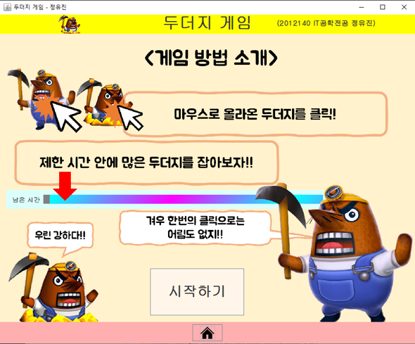
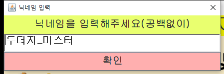
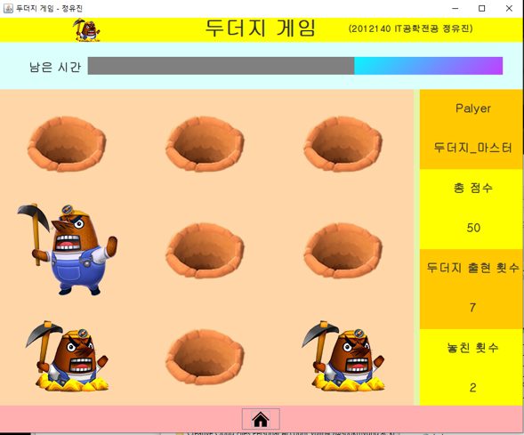
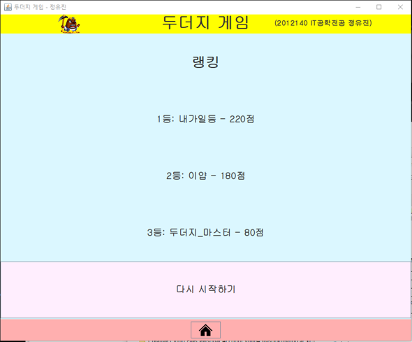
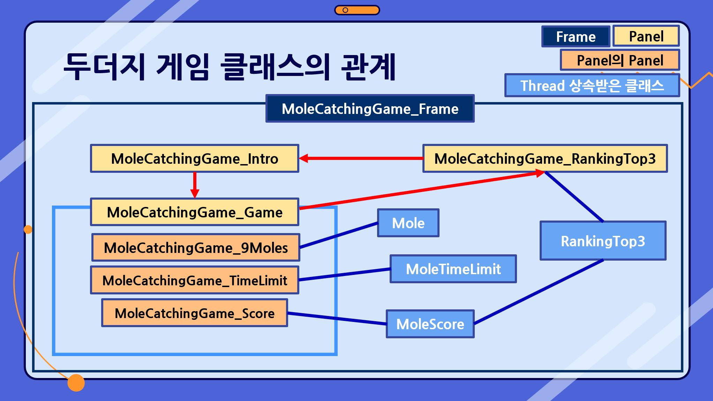
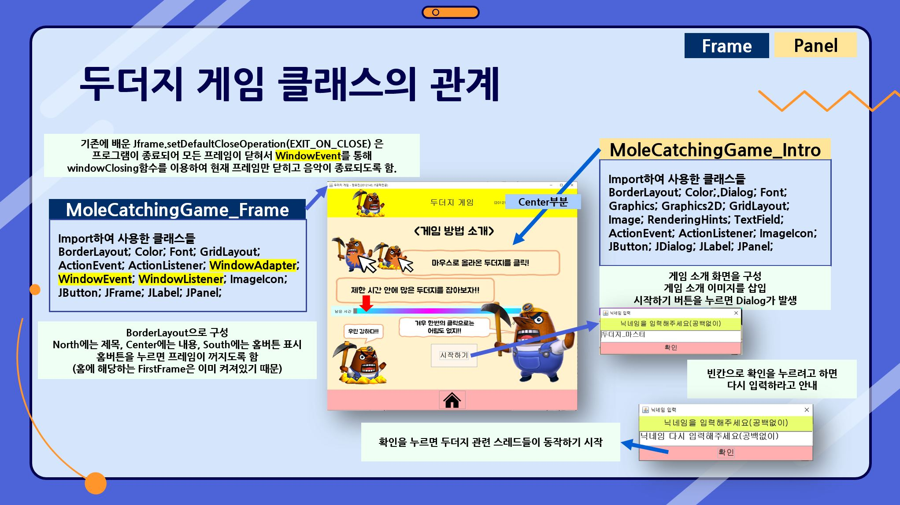
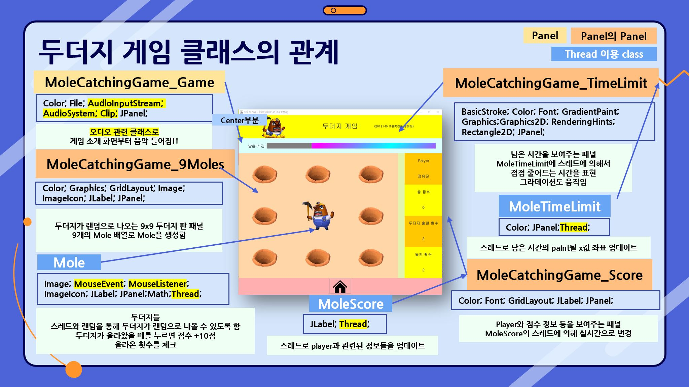
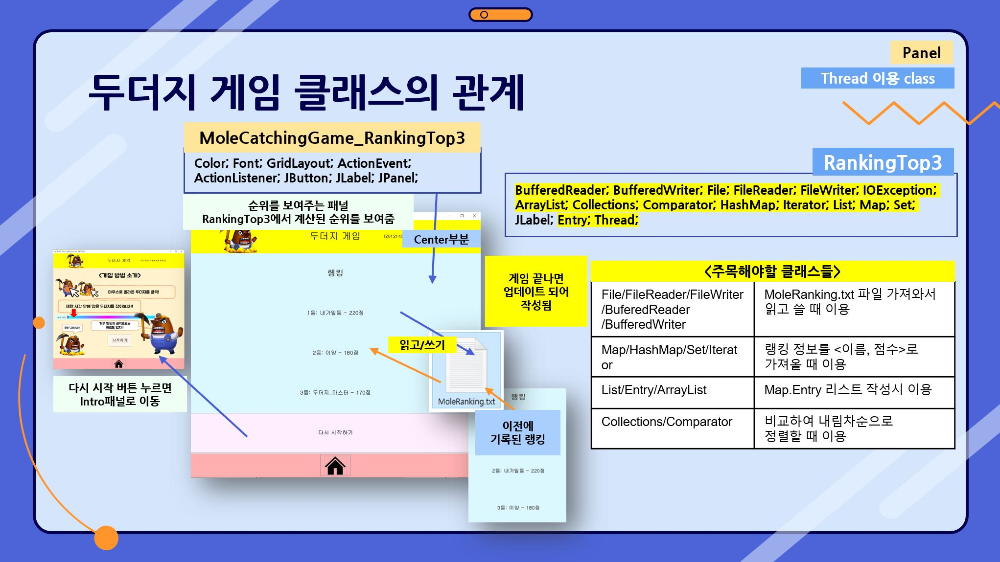

# 두더지 게임 (Mole Catching Game)

2021학년도 2학년 1학기 IT공학전공 정유진

두더지 게임은 이클립스 IDE에서 Java GUI 및 Thread 등을 이용하여 구현한 게임입니다.
Swing 및 AWT와 같은 GUI 구성 요소와 Thread 및 오디오 관련 클래스를 사용하여 만들어졌습니다.

<br>

## 게임 화면 및 게임 방법

## 홈 화면



- 게임 방법을 안내 페이지와 함께 시작하기 버튼이 있습니다.
- 올라오는 두더지를 마우스로 여러번 클릭하면 두더지가 잡혀 포인트를 얻을 수 있습니다. (1회 클릭으로 잡히지 않으니 주의해주세요!)
- 남은 시간을 보며 제한 시간 안에 많은 두더지를 잡아봅시다.
- 시작 버튼을 눌러 시작하세요.

## 닉네임 입력 창



- 게임 시작 버튼을 누르면 닉네임 입력 창이 뜹니다.
- 닉네임을 입력 후 확인 버튼을 눌러주세요.

## 게임 화면



- 두더지를 연속으로 마우스로 클릭하여 잡아봅시다.
- 현재 플레이어의 이름과 점수, 두더지 출현 횟수, 놓친 횟수는 우측 바에 표시됩니다.
- 위쪽의 남은 시간이 줄어드는 것을 잘 확인하며 게임을 진행하면 됩니다.

## 점수 화면



- 제한 시간이 끝나면 자동으로 종료됩니다.
- 이전 플레이어들의 기록과 함께 계산되어 1등부터 3등까지 닉네임과 점수가 표시됩니다.
- 다시 시작하기 버튼을 누르면 다시 시작할 수 있으며, 홈 버튼을 누르면 홈 화면으로 돌아갑니다.

<br>

## 기술 스택


## 클래스 및 설명

| 클래스 | 설명 |
| --- | --- |
| Mole | 게임 내 두더지 객체를 나타내는 클래스 |
| MoleCatchingGame_9Moles | 9x9 두더지가 생성되는 패널 |
| MoleCatchingGame_Frame | 두더지 게임의 프레임 부분을 담당하는 클래스 |
| MoleCatchingGame_Game | 두더지 게임의 게임 화면 패널을 나타내는 클래스 |
| MoleCatchingGame_Intro | 두더지 게임의 게임 소개 화면 패널을 나타내는 클래스 |
| MoleCatchingGame_RankingTop3 | 두더지 게임의 Top3 순위 화면 패널을 나타내는 클래스 |
| MoleCatchingGame_Score | 두더지 게임의 게임 화면에서 이름, 점수 등을 표시하는 패널을 나타내는 클래스 |
| MoleCatchingGame_TimeLimit | 두더지 게임의 게임 화면에서 시간 제한을 표시하는 패널을 나타내는 클래스 |
| MoleScore | 두더지 게임의 점수를 측정하는 클래스 |
| MoleTimeLimit | 두더지 게임의 시간 제한을 작동하는 클래스 |
| RankingTop3 | 이전 기록된 Top3에서 현재 플레이어 점수를 계산하고 비교하여 새로운 Top3를 기록하는 클래스 |

## 관련 클래스들

```java
import java.awt.Image;
import java.awt.BasicStroke;
import java.awt.BorderLayout;
import java.awt.Color;
import java.awt.Dialog;
import java.awt.event.ActionEvent;
import java.awt.event.ActionListener;
import java.awt.event.MouseEvent;
import java.awt.event.MouseListener;
import java.awt.event.WindowAdapter;
import java.awt.event.WindowEvent;
import java.awt.event.WindowListener;
import java.awt.Font;
import java.awt.geom.Rectangle2D;
import java.awt.GradientPaint;
import java.awt.Graphics;
import java.awt.Graphics2D;
import java.awt.GridLayout;
import java.awt.RenderingHints;
import java.awt.TextField;
import java.io.BufferedReader;
import java.io.BufferedWriter;
import java.io.File;
import java.io.FileReader;
import java.io.FileWriter;
import java.io.IOException;
import java.util.ArrayList;
import java.util.Collections;
import java.util.Comparator;
import java.util.HashMap;
import java.util.Iterator;
import java.util.List;
import java.util.Map.Entry;
import java.util.Map;
import java.util.Set;
import javax.sound.sampled.AudioInputStream;
import javax.sound.sampled.AudioSystem;
import javax.sound.sampled.Clip;
import javax.swing.ImageIcon;
import javax.swing.JButton;
import javax.swing.JDialog;
import javax.swing.JFrame;
import javax.swing.JLabel;
import javax.swing.JPanel;
import java.lang.Math;
import java.lang.Thread;
```

# 두더지 게임 클래스 관계




